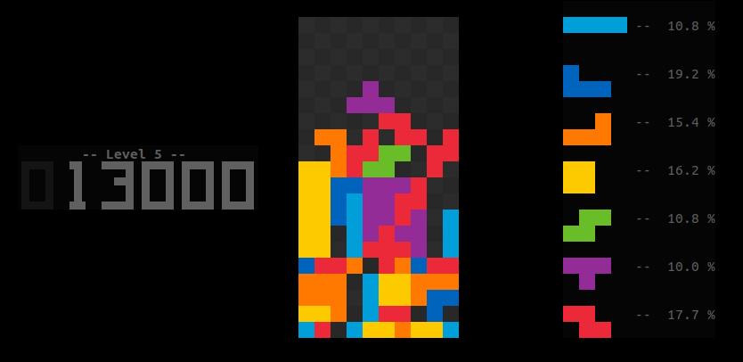

# Console Tetris for Linux [Under development]

*Basic idea taken from [maxoverride's repo](https://github.com/maxoverride/tetris_console) (which runs on windows at the time of fork).*

This project is a remake of the classic game of Tetris for the linux console.

### Tasks

- [ ] Refactor for Linux
	- [x] ~~Discard Windows Functions~~
	- [x] ~~Refactor rendering~~
	- [x] ~~Refactor key movements (ncurses used here)~~
	- [x] ~~Refactor line clearing routines~~
	- [ ] Refactor game over routine
- [ ] Refactor class heirarchy
- [ ] Add Scoreboard
- [ ] Add next block window

### Launch

- launch `tetris_runner` executable

<!-- All constant values and look up tables are in the `gameconstants.h` header file. More specifically, it contains a 2D integer array `BlockMatrix` which stores all Tetris blocks, each orientation of each block taking 4x4 locations.

In other words, each block can have **4 orientations**, and there are **7 different types of blocks** in Tetris. `BlockMatrix` is a *(4x7)x(4x4)* 2D array.

The header file `gameresources.h` contains definitions of classes, the objects of which will be used in the main game; namely:
- `GameBoard`
- `TetBlock`

The class `GameBoard` contains all the class variables and methods that are required to print and erase the board on the console screen. It stores the board information as a 2D array.

Update: variables and methods have been added to `GameBoard` for **slashing out** filled rows of the board.
The class `TetBlock` contains all the class variables and methods that are required to:

- **sample** a block from `BlockMatrix`
- **moving** the sampled block on a `GameBoard` object binded with the current object of `TetBlock` class
- **sensing** wall/other blocks in vicinity of the current object. Also checks for overlaps
- **stamping** the block associated with the current object, on the `GameBoard` object binded with it.

The header file `maingame.h` contains the class declaration `MainGame`, the object of which carries an instant of the current game. In other words, it contains instances of `GameBoard`, `TetBlock`, and methods to initialize and run the game. Additional game features such as **score monitoring**, **game over check** will be added to this class (as far as I presume at this point of time).

##Find out the .EXE file in bin/Debug folder
 -->